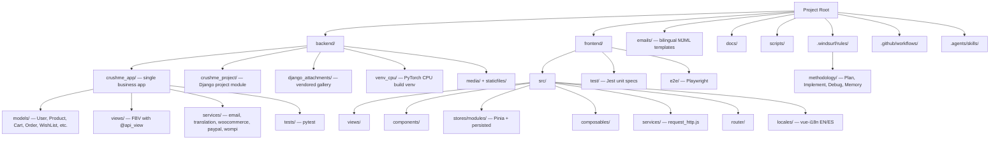

# Directory Structure

```mermaid
flowchart TD
    Root[Project Root]
    Root --> Backend[backend/]
    Root --> Frontend[frontend/]
    Root --> Emails[emails/ — bilingual MJML templates]
    Root --> Docs[docs/]
    Root --> Scripts[scripts/]
    Root --> Windsurf[.windsurf/rules/]
    Root --> GitHub[.github/workflows/]
    Root --> AgentSkills[.agents/skills/]

    Backend --> BCrushApp[crushme_app/ — single business app]
    Backend --> BProject[crushme_project/ — Django project module]
    Backend --> BAttachments[django_attachments/ — vendored gallery]
    Backend --> BVenvCpu[venv_cpu/ — PyTorch CPU build venv]
    Backend --> BMedia[media/ + staticfiles/]

    BCrushApp --> Models[models/ — User, Product, Cart, Order, WishList, etc.]
    BCrushApp --> Views[views/ — FBV with @api_view]
    BCrushApp --> Services[services/ — email, translation, woocommerce, paypal, wompi]
    BCrushApp --> Tests[tests/ — pytest]

    Frontend --> FSrc[src/]
    FSrc --> FViews[views/]
    FSrc --> FComponents[components/]
    FSrc --> FStores[stores/modules/ — Pinia + persisted]
    FSrc --> FComposables[composables/]
    FSrc --> FServices[services/ — request_http.js]
    FSrc --> FRouter[router/]
    FSrc --> FLocales[locales/ — vue-i18n EN/ES]
    Frontend --> FTest[test/ — Jest unit specs]
    Frontend --> FE2E[e2e/ — Playwright]

    Windsurf --> WMethodology[methodology/ — Plan, Implement, Debug, Memory]
```
